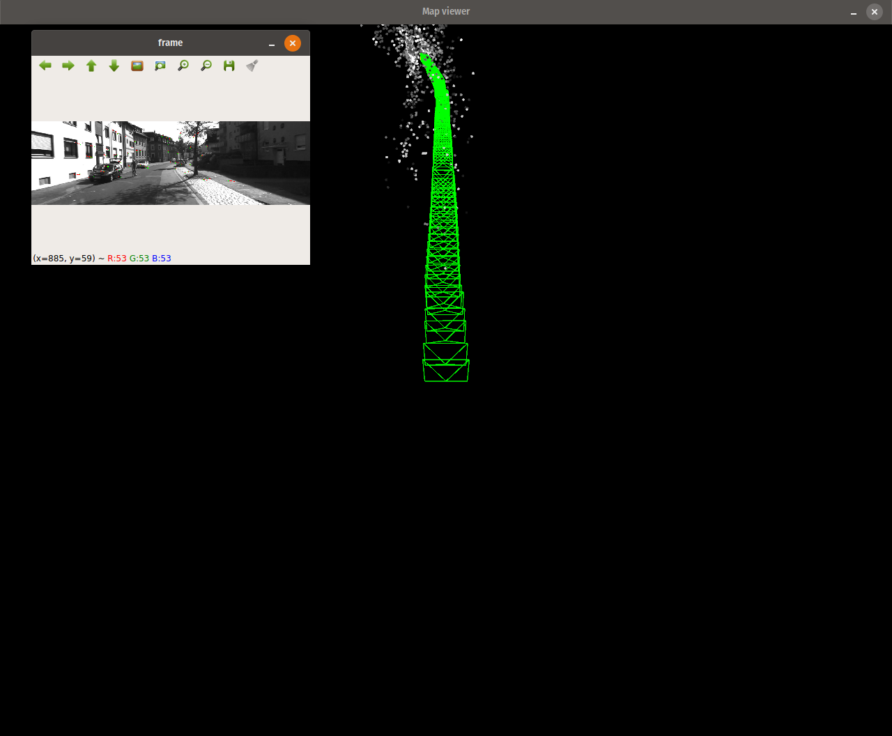

# simple-slam

Simple SLAM pipeline that creates a point cloud based map from a video input.
This was implemented as part of a course project to understand and implement the data association and backend optimization of SLAM



The codebase is heavily borrowed from [twitchslam](https://github.com/geohot/twitchslam) with minor refactoring.

## Prerequisites

- OpenCV
- Visualization - Pangolin and python bindings [pangolin](https://github.com/uoip/pangolin)
- Optimization  - g2o and its python bindings [g2opy](https://github.com/uoip/g2opy)
- skimage

## Usage

```
python main -i /path/to/video -f focal-length
```


